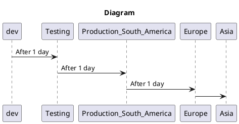

# CameraReviewBackEnd
Camera Review Backend Project

## Overview
The company "RandomCameraReviews" needs a system to permit professional photographer give "reviews" of cameras, for somebody at someplace can found the reviews and buy from the webpage.
The company has a team of developer specialized in frontEnd that will design the webpage so that editors can upload their "reviews" and the users can see them. They requested that you how specialist in backEnd, develop a system including API that allows to carry the following:
* Upload reviews of cameras.
* Get the review content to show in webpages views the web and mobile versions
* User management for publishers(don't include visitors that read the reviews)

Also if it's knowed that the "RandomCameraReviews" company plans to distribute mainly in South America where is the biggest market, but it also has sales in North America, Europe and very few in Asia.

### Scope

#### Use of case
* As a publisher, I would like to upload a review from a camera
* As a publisher, I would like to upload a review from a camera's len.
* As an User, I would like to see a review from a camera
* As an User I would like to see a review from a camera's len.
* As an User, I would like to see the biggest reveiwed cameras
* As an User, I would like to see the biggest reveiwed camera's len.
* As an User, I would like to buy a camera
* As an User, I would like to buy a camera's len.

#### Out of Scope
Descripción...
* As an user not registered, I would like to upload a review from a camera
* As an user not registered, I would like to read a review from a camera's len.
* As an user not registered, I would like to buy a camera
* As an user not registered, I would like to buy a camera's len.

## Architecture

### Diagrams
put diagrams of sequence, uml, etc

### Data Models
put entity design, Jsons, tables, diagrams entity-relation, etc.

### Test management
* Make a test project to validate the following user case.
* Register user, make review, simulate that the visitor can read the written review.

### Continuous integration

---
## Limitations
Familiar List Limitations. Can be in List format.
Example:

* API calls has permit to upload a review doesn't exceed the 500ms of latency limits.
* API calls has permit reviews for reading must be a latency less than 100 ms.

---
## Cost
Description/Cost analysis

You can consider 1000 daily users to visit the website in an hour..

Example:
"Considering N daily users, M calls for X service/DataBase/etc"
* 1000 dairy calls to serverless functions $XX.XX
* 1000 daily read/write units to X Database on-demand. $XX.XX
Total: $xx.xx (to month/day/year)
